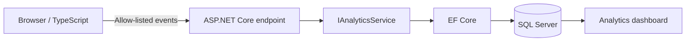

# Privacy-Friendly Analytics for ASP.NET Core

**Self-hosted product telemetry with ASP.NET Core, EF Core, SQL Server and TypeScript — without third-party tracking.**

A small, self-hosted product analytics reference implementation for ASP.NET Core applications.

Built with **.NET 10, ASP.NET Core, EF Core, SQL Server and TypeScript**.

The goal is deliberately narrow: understand how a product is used without automatically shipping business inputs or user-entered domain data to a third-party analytics platform.

> Created and maintained by **Diego Riccardi / [DrikWeb](https://drikweb.com/)**, an independent .NET software development and consulting practice.
> The project originated from a real product requirement and was extracted into a reusable reference implementation.

## The problem

Client-side applications often keep sensitive or business-specific calculations in the browser, but product teams still need to answer questions such as:

- Are users starting and completing the main workflow?
- Which optional features are used?
- What is the workflow completion rate?
- Is explicit feedback positive or negative?

This project demonstrates one way to collect only the telemetry required to answer those questions.

## Architecture



```text
src/
├── DrikWeb.PrivacyFriendlyAnalytics.Application
├── DrikWeb.PrivacyFriendlyAnalytics.Infrastructure
└── DrikWeb.PrivacyFriendlyAnalytics.Web

tests/
└── DrikWeb.PrivacyFriendlyAnalytics.Tests
```

## Events included in the demo

- `demo_opened`
- `workflow_started`
- `workflow_completed`
- `feature_used`
- `feedback_submitted`

The server rejects unknown event names and ignores properties that are not explicitly allow-listed.

## Privacy by design

The sample intentionally follows data-minimization principles:

- No account is required.
- No persistent browser identifier is created.
- The session identifier exists only for the lifetime of the page.
- No IP address is explicitly persisted in the analytics database.
- Form values are never included in analytics requests.
- Event properties are allow-listed server-side.
- Nested objects and arbitrary payloads are rejected by the sanitizer.
- String properties have strict size limits.

This is an implementation example, not legal advice. A production deployment must document its actual behavior and assess the privacy and ePrivacy rules applicable to its jurisdiction and use case.

## Best-effort telemetry

Analytics should not become a dependency of the core product workflow.

The TypeScript client:

- sends telemetry asynchronously;
- uses a short timeout;
- catches network failures;
- never blocks the sample workflow when analytics is unavailable.

The ingestion endpoint logs unexpected persistence failures without exposing implementation details to the browser.

## Ingestion protection

The demo endpoint uses ASP.NET Core rate limiting:

- 60 requests
- per one-minute fixed window
- per application instance in this simple sample

For a public production service, choose limits and partitioning appropriate for your traffic model.

## Run locally

Requirements:

- .NET 10 SDK
- Docker Desktop or another SQL Server instance
- Node.js only if you want to modify and recompile the TypeScript source

Start SQL Server:

```bash
docker compose up -d
```

Restore:

```bash
dotnet restore
```

Apply the migration:

```bash
dotnet ef database update \
  --project src/DrikWeb.PrivacyFriendlyAnalytics.Infrastructure \
  --startup-project src/DrikWeb.PrivacyFriendlyAnalytics.Web
```

Run:

```bash
dotnet run --project src/DrikWeb.PrivacyFriendlyAnalytics.Web
```

## Visual Studio

Set:

- **Startup Project:** `DrikWeb.PrivacyFriendlyAnalytics.Web`
- **Package Manager Console Default Project:** `DrikWeb.PrivacyFriendlyAnalytics.Infrastructure`

Then:

```powershell
Update-Database
```


## TypeScript

The compiled JavaScript used by the demo is committed to the repository, so Node.js is **not required** to build or run the ASP.NET Core application.

If you modify the TypeScript source, install Node.js and rebuild the client assets:


```bash
cd src/DrikWeb.PrivacyFriendlyAnalytics.Web
npm install
npm run build
```

The generated JavaScript is written to `wwwroot/js/analytics-demo.js`.

## API example

```bash
curl -X POST https://localhost:5001/api/analytics/events \
  -H "Content-Type: application/json" \
  -d '{
    "eventName": "feature_used",
    "sessionId": "2dbb94d2-4ab6-4689-9ccb-61f00f250f91",
    "pagePath": "/",
    "properties": {
      "feature": "optional_demo_feature"
    }
  }'
```

Unknown event names return `400`. Unknown property names are discarded.

## Dashboard

`/dashboard` provides a deliberately small operational view:

- total events;
- page sessions;
- workflows started;
- workflows completed;
- completion rate;
- positive feedback rate;
- event counts;
- recent events.

The dashboard is public only to keep the repository easy to run. **Protect it with authentication and authorization before adapting this project to production.**

## Design decisions

### SQL Server instead of a third-party analytics provider

The application owns its telemetry schema and retention strategy. This is useful when only a small, deliberate event set is required.

### Application-level allow-list

The client cannot decide what arbitrary data is persisted. Both event names and property names are constrained by the server.

### No persistent anonymous user ID

The demo correlates events within one page lifetime but deliberately avoids identifying returning browsers.

### Generic event model

The infrastructure does not contain product-specific financial or business fields. Product-specific meaning is expressed through a small set of named events and coarse properties.

### Separate application and infrastructure layers

The web application depends on `IAnalyticsService`; EF Core persistence remains an infrastructure concern.

## Tests

Run:

```bash
dotnet test
```

The initial test suite verifies important data-minimization behavior, including property allow-listing, string limits, and rejection of nested JSON values.

## Production checklist

Before using this approach in a real application:

1. Protect the dashboard with authentication and authorization.
2. Define a telemetry retention policy and automated cleanup.
3. Move the connection string to environment variables or a secret store.
4. Review logging so request bodies containing user data are never captured accidentally.
5. Tune rate limiting and consider distributed rate limiting for multi-instance deployments.
6. Consider a queue or batching strategy for high event volume.
7. Monitor analytics failures independently from the product workflow.
8. Reassess the event/property allow-list whenever product telemetry changes.

## Roadmap

Possible next steps:

- configurable retention cleanup;
- time-range filters in the dashboard;
- CSV export;
- optional buffered event ingestion;
- PostgreSQL provider example;
- reusable NuGet package.

## Author

Created and maintained by **Diego Riccardi / [DrikWeb](https://drikweb.com/)**.

For more .NET architecture, modernization, API and software engineering content, visit [drikweb.com](https://drikweb.com/).

## License

MIT
